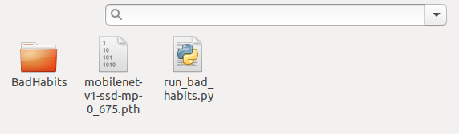
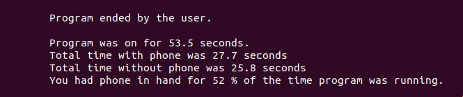
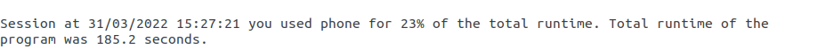

# BAD HABIT DETECTOR

## PROJECT SCOPE
This project has been in my mind for quite some time now. Finally found perfect way to execute with Nvidia Jetson NANO. Idea of this project came when I personally realized that I have some bad habits while trying to get some work done. Well, I think this applies to a lot of people doing this line of work or as a hobby. Bad Habit numero uno; phone, telephone, mobilephone, smartphone or what ever you might call it. It tends to be in my hand the second I have some freetime. So this project is made to detect Bad Habits while on computer. Also it returns some useful statistics which can be used by the user the way they find fit.


## DEMO
Short GIF demo of the project.


[Demo video(YouTube)](https://youtu.be/pHagrnlfpB0)


## USER INSTRUCTIONS


## REQUIREMENTS
This project was made in its entirety on Nvidia Jetson NANO (4GB)


##### NEEDED PHERIPHERALS AND DEVICES
- Nvidia Jetson NANO Developer Kit
- USB Webcam or CSI Cam
- Mouse and Keyboard
- HDMI or DisplayPort cable
- Display
- WiFi dongle/module or Ethernet cable
- Micro-USB power cable or DC Barrel Jack power supply
- microSD card (64GB recommended)


##### SETTING UP THE ENVIRONMENT
- Make sure you have required items 
- Flashing image to microSD card
- Initial setup with display attached
> [Detailed instructions from Nvidia](https://developer.nvidia.com/embedded/learn/get-started-jetson-nano-devkit#prepare)


##### HOW TO RUN

Clone this Github repository

```
$ cd
$ git clone https://github.com/tinonum/Bad-Habit-Detector.git
```

First we need to run jetson-inference Docker container as follows

```
$ git clone --recursive https://github.com/dusty-nv/jetson-inference
$ cd jetson-inference
$ docker/run.sh
```
When you run `run.sh` just download everything default, no need to modify anything

After `run.sh` script is done you can exit the container for now
```
$ exit
```

Then little tricky part
1. Move `BadHabits` folder into `jeston-inference/python/training/detection/ssd/models`
2. Move `run_bad_habits.py` into `jeston-inference/python/training/detection/ssd/models`

Now your `jeston-inference/python/training/detection/ssd/models` should look like this.



How to run the program

```
$ cd jetson-inference
$ docker/run.sh
$ cd python/training/detection/ssd/models
$ python3 run_bad_habit.py
```
> Note that running program first time will take some time. TensorRT needs to create .engine file out of the provided model.
> [More about TensorRT](https://docs.nvidia.com/deeplearning/tensorrt/developer-guide/index.html)

How to stop the program

1. Make sure your cursor is in terminal
2. Use KeyboardInterrupt to collect the data (CTRL+C)

Examples of possible outputs

1. Terminal output example



2. File output example




## PROGRAM FUNCTIONALITIES
`Bad Habit Detector` can be let run on background and collecting data on your Bad Habits. When user exist the program, program prints a preview of the statistics. Such as program run time, total time with phone, total time without phone and percentage of how long you were exercising bad habits. Program also creates a text file called `bad_habit_statistics.txt`. This will be made into `/models` folder.


## SCALABILITY / EXTENDING THE PROGRAM
`Bad Habit Detector` is really scalable program. Program is re-trained ssd-mobilenet DNN. With currently one class in it. Other bad habits can be added to the program to get more useful data out of your time on computer or pretty much anywhere in that matter. Data coming out of the program could be used to monitor your behaviour in given days and times. I have decided to let the user decide how to utilize the data. Personally I use the data to monitor how well I can get rid of these bad habits. 


## DATA COLLECTION
Images and annotations were collected fully by me. Using jetson-inference camera-capture script.

## AUTHOR
Tino Nummela

## REFERENCES
> [Repository of jetson-inference](https://github.com/dusty-nv/jetson-inference)
